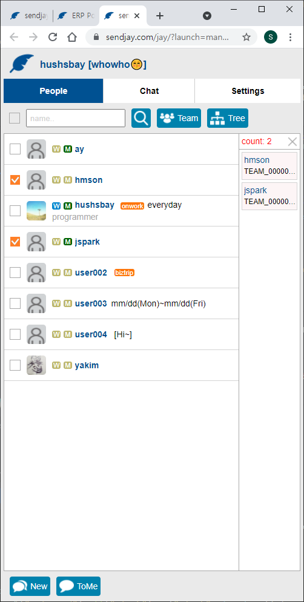
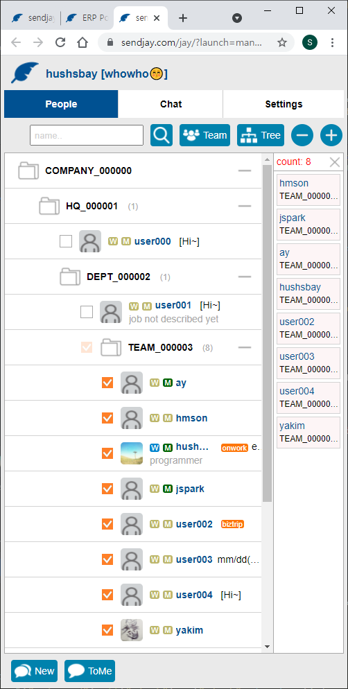
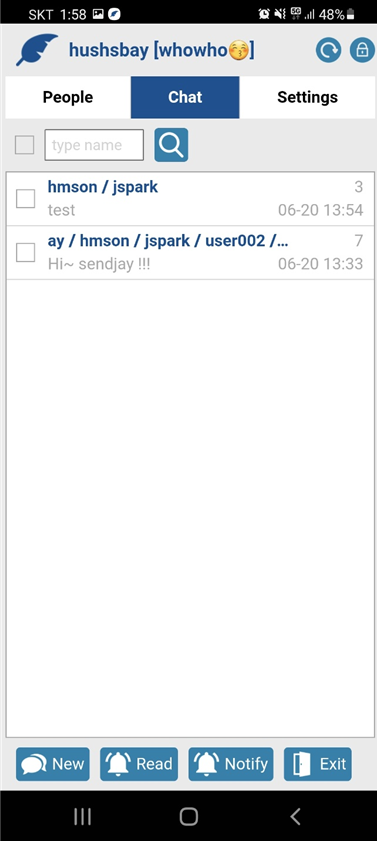
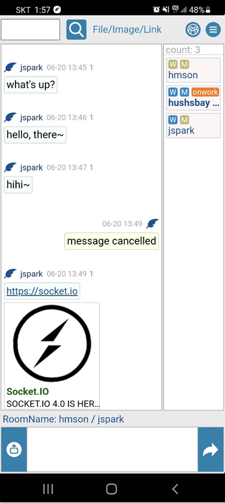

'sendjay' Enterprise Messenger. 사내 메신저 (업무용 메신저)  

sendjay는 GitHub 소스를 이용하여 본인의 회사 환경에 맞게 사내 메신저를  
직접 구축하는 개발자를 위한 프로젝트입니다. 

- multi socket server, multi chat window : nodejs, socket.io, redis, mysql, jquery
- web messenger : embeded on your portal site like system tray
- android(kotlin) and ios(swift) supported : reuse web module on mobile webview

See the details and test at [https://sendjay.com](https://sendjay.com).

Web Messenger Demo 01  

Web Messenger Demo 02  

Mobile Messenger Demo 01  

Mobile Messenger Demo 02  

All .github files should be handled as follows when real use in your environment after download.  
아래와 같이 .github로 끝나는 파일은 다운로드후 실제 운영 적용시 .github를 제거하고 사용하시기 바랍니다.

- package.json.github -> package.json
- nodeconfig.js.github -> nodeconfig.js
- start.bat.github -> start.bat
- start1.bat.github -> start1.bat
- start_d01.bat.github -> start_d01.bat

MIT License.
All npms are MIT Licenses. (except firebase-admin npm : Apache-2.0 License)
